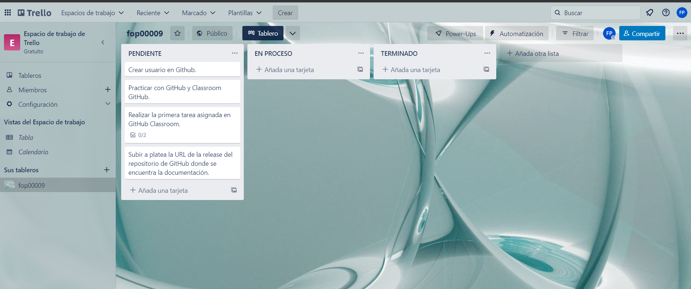
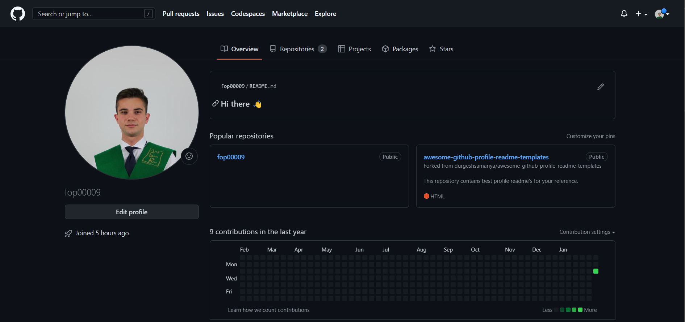
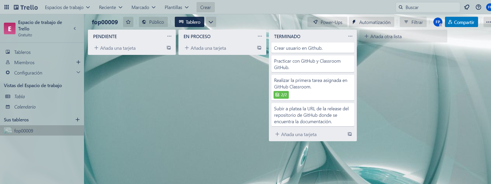

# Plantilla Práctica 1
Este es un repositorio básico para comprobar cómo funciona GitHub y, especialmente, GitHub Classroom.

Tus tareas consisten en:
1) Modificar este fichero README.md de modo que pongas tus datos en formato MarkDown.
  ### Francisco Ortega Peña.
  
  
  
  
  * **Correo**: fop00009@red.ujaen.es
  * **GitHub**: https://github.com/fop00009
  * **Trello**: https://trello.com/u/fop00009
  
2) Añadir un fichero <code>datos.json</code> en el que se almacenen los mismos datos (incluída la URL de la imagen) en formato [JSON](https://es.wikipedia.org/wiki/JSON).

### URL del tablero de trello: https://trello.com/b/cDTvyz94/fop00009
### Contenido:

### GitHub URL: [https://trello.com/b/cDTvyz94/fop00009](https://github.com/fop00009)
### Usuario GitHub: fop00009
### Captura de pantalla: 

### Captura tablero Trello final:

### Víctor M. Rivas Santos

Profesor del departamento de Informática de la Universidad de Jaén.
* **Correo**: vrivas@ujaen.es
* **Web**: http://vrivas.es
* **GitHub**: https://github.com/vrivas/
* **Trello**: https://trello.com/vrivas_ujaen_es
